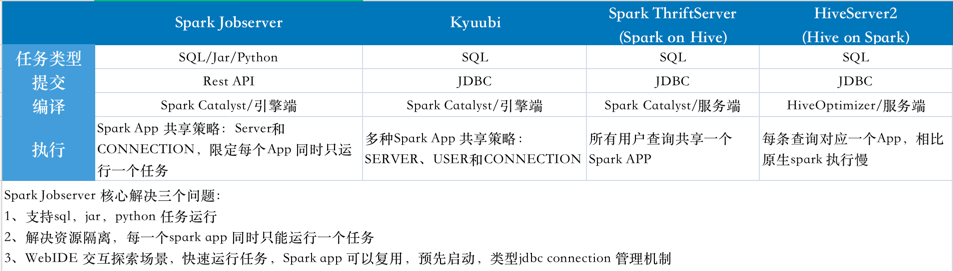
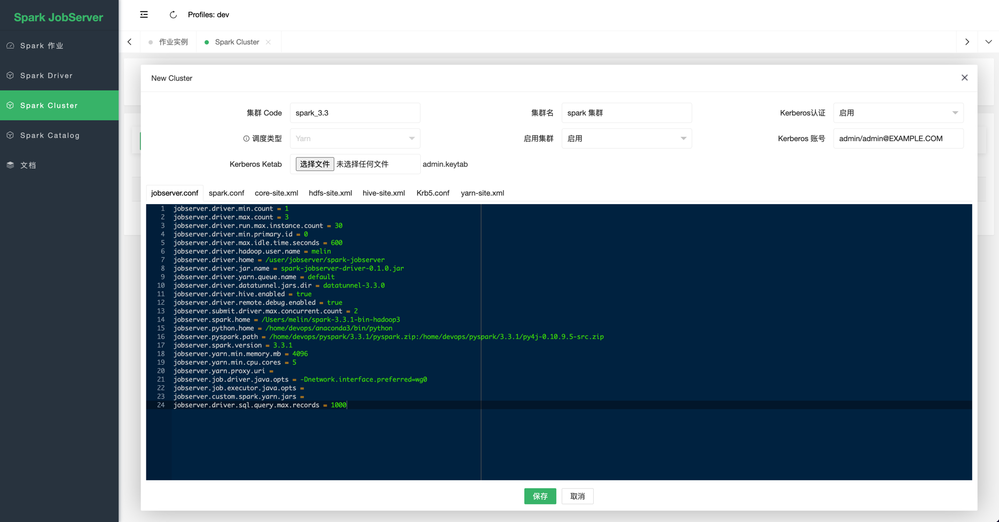
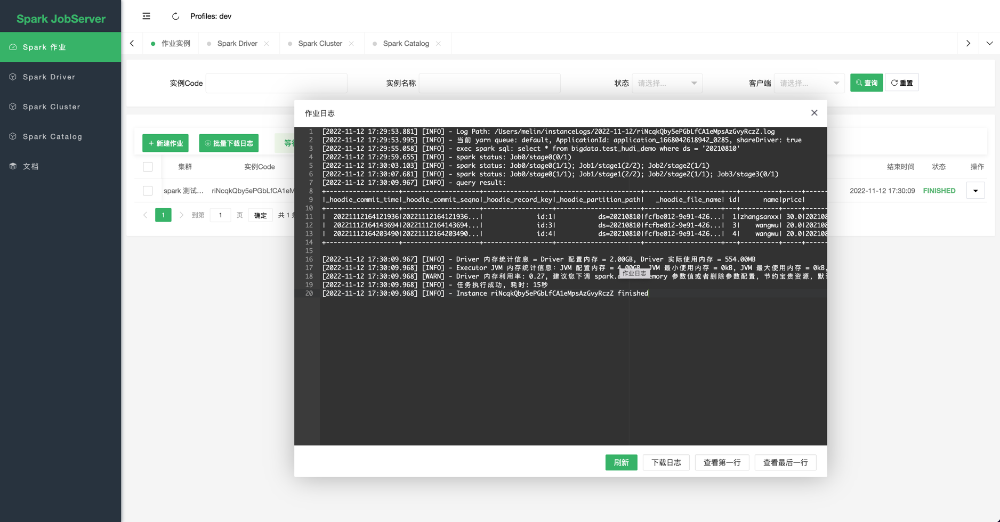
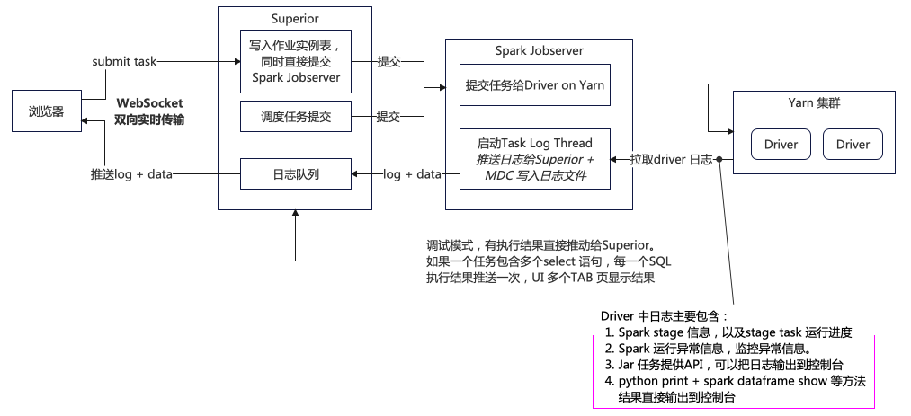

## REST job server for Apache Spark 

job server 同时支持sql、jar、python 任务提交运行，对比其他常见解决方案：


主要特点

1. 通过Rest API 提交spark 作业运行，支持sql，java/scala，python类型作业，解耦业务系统与spark 集群。
2. Spark Job 运行资源相互隔离以及高可用性，每一个job 独立运行在一个Spark driver中。
3. 预启动 Spark Driver，提高Job 启动速度，Driver 共享运行多个Job(同时只有一个job运行)
4. 支持多Yarn集群部署，Client 提交Job 到指定集群运行。
5. Driver 定制化，可以实现比较多能力，例如：表权限，碎片文件压缩，DQC等功能。
6. 支持作业实例任务依赖(DAG),
7. 支持spark streaming sql，方便对接kafka、debezium、canal、hudi cdc等流数据源，具体请参考 [spark-streaming-sql.md](docs%2Fspark-streaming-sql.md)
8. 更加灵活的对调度任务并发控制和优先级，例如单个用户最大并发数量，不完全依赖底层yarn、k8s等资源管理能力。例如一些调度框架是把作业直接传给yarn 资源管理器，如果yarn资源不够，提交上去的任务全部在yarn 等待队列中。CDH 默认是公平调度，会导致任务无法按照优先级运行。
9. 动态注册jdbc catalog，具体参考 [dynamic-jdbc-catalog.md](docs%2Fdynamic-jdbc-catalog.md)
10. 支持kerberos 认证

@TODO
1. 集成k8s
2. 支持作业定时调度, 可以减少其它调度系统依赖。(一个简易的方案，每天凌晨生成当天需要运行的作业实例，再轮训作业实例表，阿里云dataworks 每天千万级别的任务实例，也是轮训数据库方案)
3. 集成数据权限、数据血缘(借鉴 kyuubi，但不依赖ranger)
4. 完善调度任务优先级。
5. spark jar 上传管理






## 一、Build

```
mvn clean package -Prelease,hadoop-2 -DlibScope=provided
mvn clean package -Prelease,hadoop-3 -DlibScope=provided
mvn clean package -Prelease,cdh6 -DlibScope=provided
```

## 二、作业实例接口
包含作业实例提交、作业实例状态查询、作业实例运行日志查询、终止作业实例接口，具体接口：[Rest API](https://github.com/melin/spark-jobserver/blob/master/jobserver-admin/src/main/java/io/github/melin/spark/jobserver/web/rest/JobServerRestApi.java)

## 三、作业开发
spark jar和python 作业类型，作业代码中不需要初始化sparkSession，SparkJobserver 初始化sparkSession，传递给作业，目的是为了统一规范作业配置，以及共享sparkSession。

### 1、Spark jar 作业
请参考: [Spark jar](https://github.com/melin/spark-jobserver/tree/master/jobserver-api)

### 2、Spark pyhton 作业
python 作业入口方法为：main，
```python
def main(sparkSession):
  print("hello world")
```

## 四、Yarn Cluster 模式部署
### 1、准备环境
Spark 任务运行环境：Hadoop 2.7.7，Spark 3.3.1。为避免每次任务运行上传jar，提前把相关jar 上传到 hdfs 路径。根路径：/user/superior/spark-jobserver (可以在集群管理中通过，修改jobserver.driver.home 参数设置)，根路径下有不同jar 和 目录
1. spark-jobserver-driver-0.1.0.jar  -- spark jobserver driver jar，jar 参考编译spark jobserver 部分。
2. aspectjweaver-1.9.9.1.jar  -- aspectj 拦截spark 相关代码，实现功能增强，直接maven 仓库下载
3. spark-3.3.1  --Spark 依赖所有jar，从spark 官网下载: spark-3.3.1-bin-hadoop2.tgz, 解压后把jars 目录下所有jar 上传到 spark-3.3.1 目录。
4. 集成hudi(可选)，下载 https://repo1.maven.org/maven2/org/apache/hudi/hudi-spark3.3-bundle_2.12/0.12.1/hudi-spark3.3-bundle_2.12-0.12.1.jar 文件 上传到 spark-3.3.1 目录


### 2、Yarn 集群配置要求
1. yarn 开启日志聚合，方便出现问题查看日志
2. yarn 配置spark_shuffle，spark 需要开启动态资源分配
3. yarn 开启cgroup cpu 资源隔离，避免资源争抢
4. 开启 history server
5. hdfs block 设置为256M

### 3、部署 jobserver admin 服务

上传 spark-jobserver-0.1.0.tar.gz 文件到服务器，直接解压生成目录：spark-jobserver-0.1.0
> tar -zxf spark-jobserver-0.1.0.tar.gz

创建数据jobserver，执行 script/jobserver.sql 脚本，创建表。

### 4、集群相关参数

[参考代码](https://github.com/melin/spark-jobserver/blob/master/jobserver-admin/src/main/java/io/github/melin/spark/jobserver/SparkJobServerConf.java)

### 5、启动服务

```
./bin/server.sh start dev
-- 启动脚本有两个参数
第一个参数可选值：start、stop、restart、status、log，启动status 和 log 不需要指定第二参数。
第二个参数可选值：dev、test、production。对应spring boot profile，对应应用启动加载conf目录下application-[profile].properties 文件
```

Web Console: http://ip:9001, 默认账号/密码: jobserver/jobserver2022

## 五、相关项目
1. https://gitee.com/melin/bee
2. https://github.com/melin/superior-sql-parser
3. https://github.com/melin/superior-sql-formatter
4. https://github.com/melin/superior-sql-autocomplete
5. https://github.com/melin/datatunnel
6. https://github.com/melin/flink-jobserver

